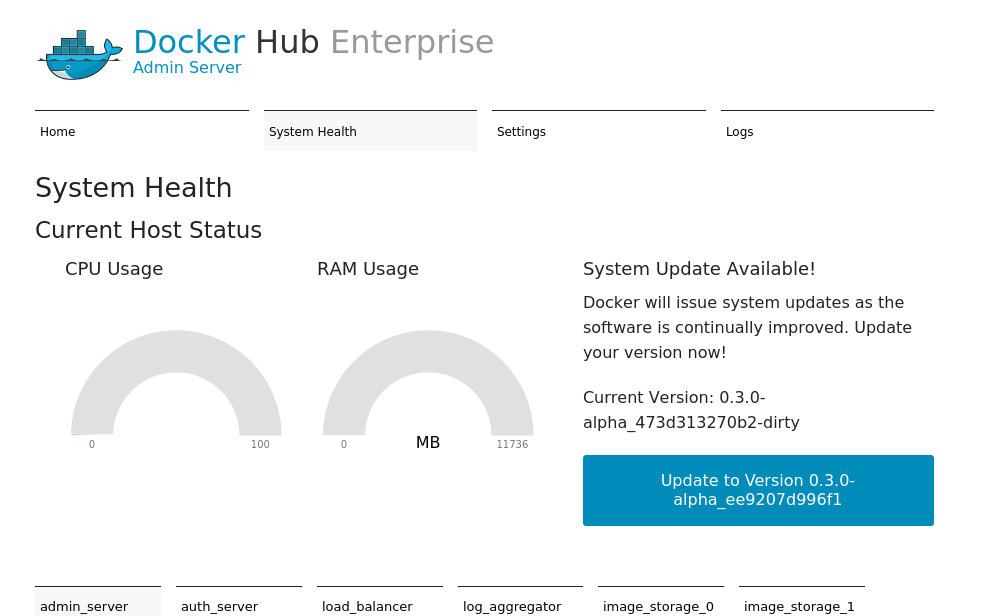

# Docker Hub Enterprise 管理员指南

本指南包含几个DHE管理员的任务或者功能将需要被知道，例如报告、日志、系统管理、运行性能等。对于大多数任务，DHE用户需要提前了解，例如使用DHEpush和pull镜像，请访问[用户指南](userguide.md)。

## 报告

###　System Health

"System Health" 页签显示了可利用资源的图表。CPU和RAM使用情况在顶部就能看到，更加详细的时间序列图表将后续支持。你可以鼠标滑上报表查看星系的数据点。

点击一个服务名称（例如"load_balancer", "admin_server"等）将显示网络、CPU和内存使用数据对于指定的服务。查看如下[detailed explanation of the available services](https://docs.docker.com/docker-hub-enterprise/adminguide/#services)。

### 日志

 "Logs" 页签查看和你DHE相关的日志信息。你将看到不同服务的日志信息。老的和新的日志通过华东滚动条都可以看到。查看如下[detailed explanation of the available services](https://docs.docker.com/docker-hub-enterprise/adminguide/#services)。

DHE的日志文件可以在主机/usr/local/etc/dhe/logs/看到。这些文件限制达到一个最大的大小64MB。他们每两周循环一次，当整合者发送整合服务或者他们达到循环的要求（超过64MB）。日志文件被命名为<component name>-<timestamp at rotation>，这里的"component name"是它提供的服务(例如manager, admin-server)。

### 使用报告以及异常报告

在正常使用过程中，DHE会生成使用数据和异常报告。这些信息会被docker Inc.收集并帮助我们事务的本质以及解决bug并提升我们的产品。特别地，Docker Inc收集如下信息：

* Error logs
* Crash logs

##　紧急访问DHE

如果你的认证或者公有权限能访问DHE网页突然停止了，但是你的DHE管理容器缺是依然运行着的，你可以添加一个 [ambassador container](../Articles/ambassador_pattern_linking
.md)来获得一个临时非安全访问。

	$ docker run --rm -it --link docker_hub_enterprise_admin_server:admin -p 9999:80 svendowideit/ambassador

> 说明：本指南假设你可以运行Docker命令从一个含有docker group的用户或者具有root权限的机器上。换句话说，你需要添加sudo在示例命令前。

你将通过端口9999访问你的DHE server：
	http://<dhe-host-ip>:9999/admin/

## 服务

DHE运行数个Docker服务。这些服务，你可以通过 System Health 和 Logs页查询到运行情况。

* admin_server: Used for displaying system health, performing upgrades, configuring settings, and viewing logs.
* load_balancer: Used for maintaining high availability by distributing load to each image storage service (image_storage_X).
* log_aggregator: A microservice used for aggregating logs from each of the other services. Handles log persistence and rotation on disk.
* image_storage_X: Stores Docker images using the Docker Registry HTTP API V2. Typically, multiple image storage services are used in order to provide greater uptime and faster, more efficient resource utilization.

## DHE system management

The dockerhubenterprise/manager image is used to control the DHE system. This image uses the Docker socket to orchestrate the multiple services that comprise DHE.

 	$ sudo bash -c "$(sudo docker run dockerhubenterprise/manager [COMMAND])"

Supported commands are: install, start, stop, restart, status, and upgrade.

Note: sudo is needed for dockerhubenterprise/manager commands to ensure that the Bash script is run with full access to the Docker host.

## Next Steps
For information on installing DHE, take a look at the Installation instructions.