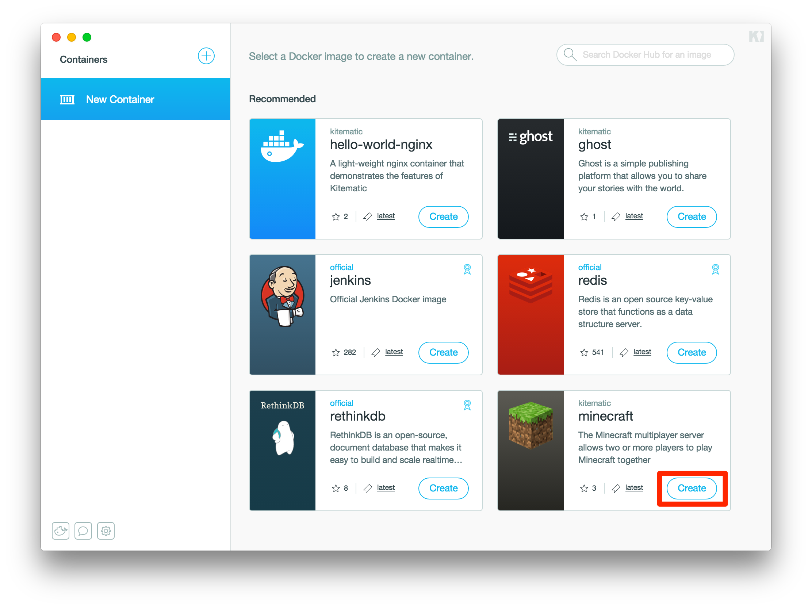
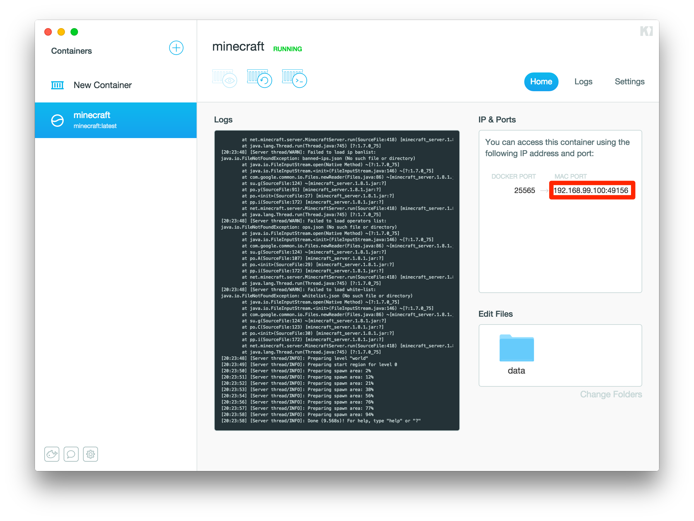
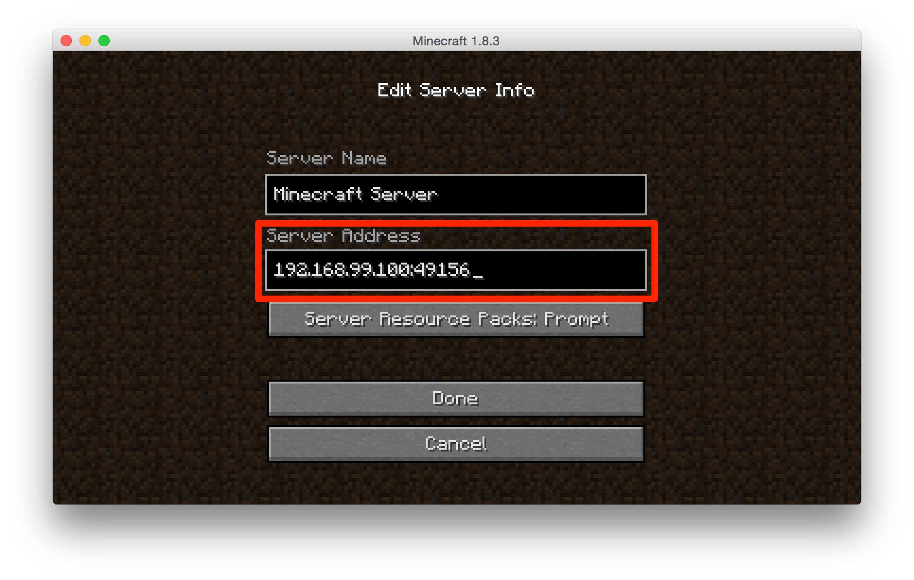
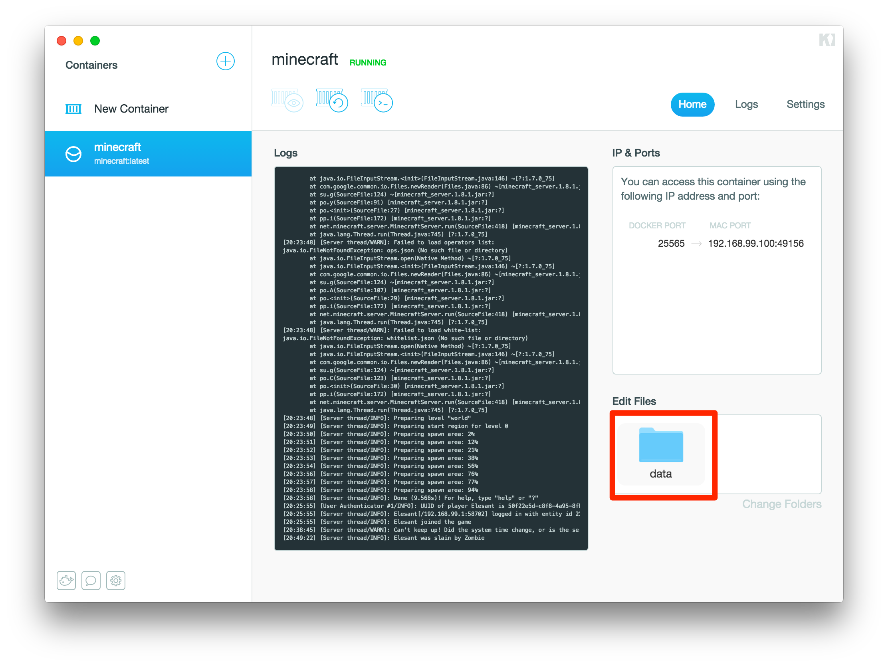
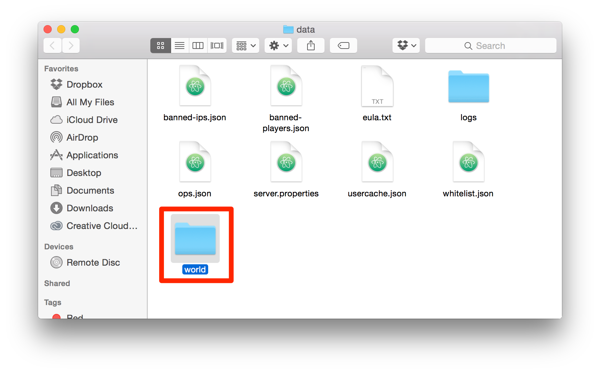
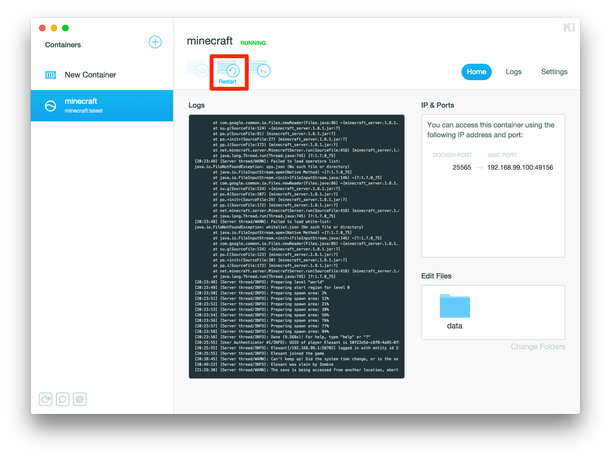

# Kitematic 教程：安装一个Minecraft服务

这是一个快速的Demo，解释怎样安装一个本地Minecraft服务，使用Kitematic和Docker。

## 创建Minecraft服务容器

首先，如果你没有安装或者启动Kitematic，你需要[安装](install.md)。一旦你安装并运行，app张如下这样：

创建一个容器从推荐的Minecraft镜像中，点击**创建**按钮。

随后，镜像结束下载，你将看到Minecraft容器的主界面。你的Minecraft服务现在已经启动并运行了一个Docker容器。注意，我们标记了IP和端口，你可以使用来链接你的Minecraft服务，在标记红色的部分。

## 链接到Minecraft服务

打开你的Minecraft客户端，登录你的Minecraft账号，点击**更多玩家**按钮。

点击，添加服务按钮来添加Minecraft服务你需要链接到的。

填写**服务地址**输入框，写入IP和端口。

点击播放按钮来链接到你的Minecraft服务然后尽情享受吧！

## 修改映射的Docker数据卷

打开”Data“文件夹在Kitematic上。我们使用Docker数据卷来映射Minecraft Docker容器到你的电脑上。

文件夹打开过后，允许你替换当前的地图。

重启你的容器通过点击**重启**按钮。

会退到你的Minecraft客户端然后尽情享受你的服务吧！新的地图将会被加载。

下一步

这里有关怎样运行Nginx的内容，你可以阅读[这里](nginx-web-server.md)。